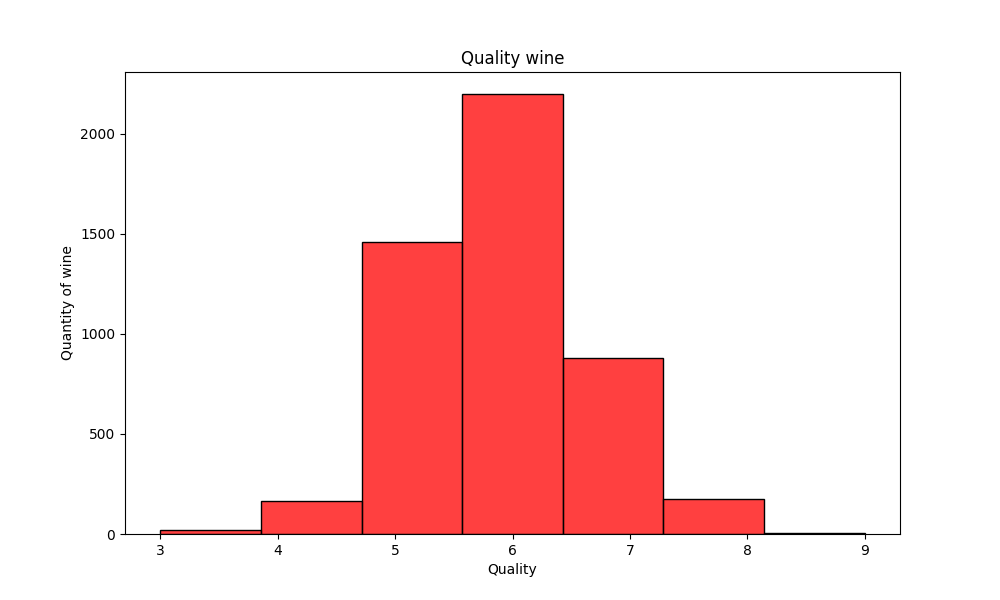
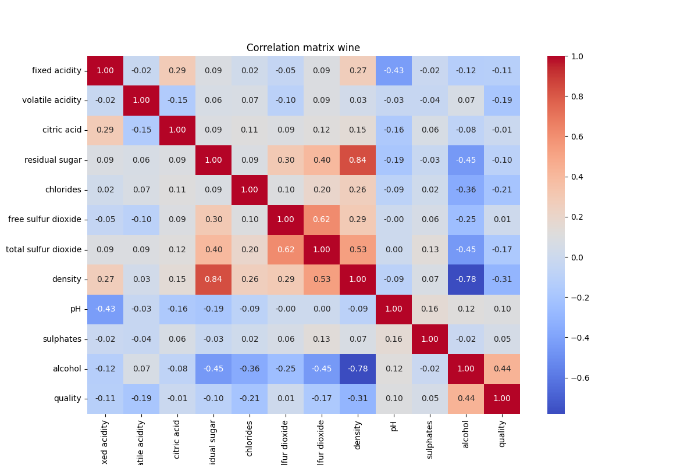
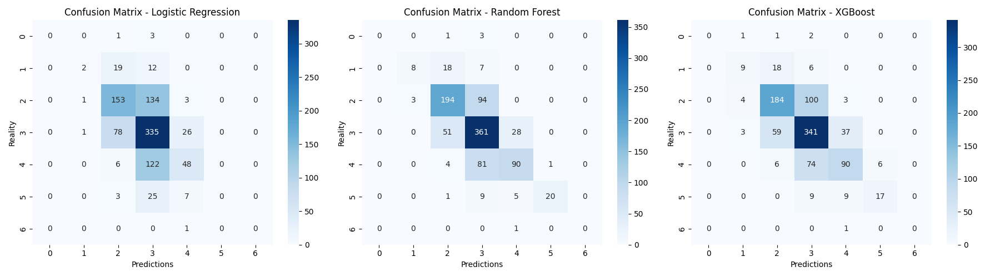
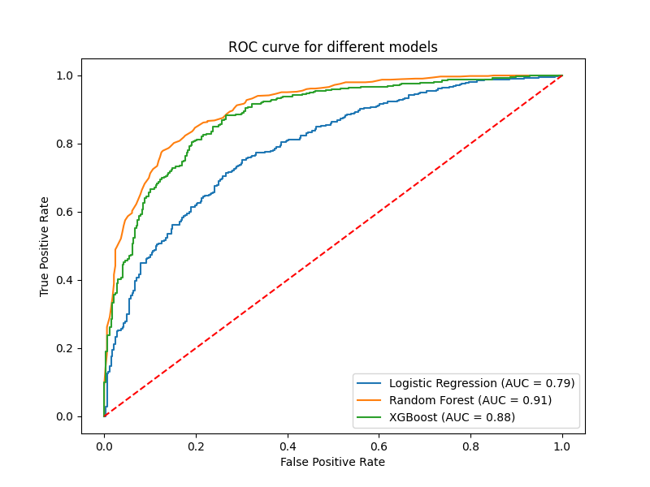

# Machine Learning Wine Quality Classification

Machine learning project focused on binary and multiclass wine quality classification using supervised learning algorithms.

## Technologies

* Python 3.13
* Pandas
* NumPy
* Matplotlib
* Seaborn
* Scikit-learn
* XGBoost

## Dataset

Dataset: `wine.csv`

Target variable:

* `quality` (wine quality score)

## Implemented Tasks

* Data loading and missing value analysis
* Correlation matrix
* Binary target transformation
* Train/Test split
* Stratified Train/Test split
* Feature standardization
* Logistic Regression
* Random Forest Classifier
* XGBoost Classifier
* Confusion Matrix
* ROC Curve
* Multiclass Classification

## Visualizations

### Wine Quality Distribution



### Correlation Matrix



### Confusion Matrices



### ROC Curve



## Installation

```bash
python -m venv .venv
source .venv/bin/activate

pip install -r requirements.txt
```

## Run

```bash
python src/07_classification_models.py
```
